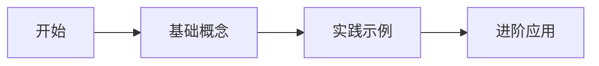

# 文档简介

欢迎来到我的文档中心！在这里，您可以找到关于各种技术主题的详细指南和教程。

## 如何使用本文档

本文档采用了清晰的分类和结构，方便您快速找到所需的信息：

1. 使用左侧的导航栏浏览不同的文档分类
2. 使用顶部的搜索功能查找特定内容
3. 每个文档页面底部都有"上一页"和"下一页"导航

## 文档内容概览

本文档中心包含以下几个主要部分：

### 基础教程

这部分内容适合初学者，涵盖了基本概念和入门知识。

### 高级指南

针对有一定基础的用户，提供更深入的技术讲解和最佳实践。

### 参考资料

API参考、配置选项和其他技术细节的完整参考资料。

## 如何贡献

我们欢迎您为这些文档做出贡献！如果您发现任何错误或有改进建议，请：

1. 点击页面底部的"编辑此页"链接
2. 提交您的更改或建议
3. 创建一个 Pull Request

## 开始使用

选择左侧导航中的任何一个主题开始您的学习之旅，或者继续阅读[基础教程](./tutorial-basics/create-a-document.md)以了解更多信息。

感谢您访问我的文档中心！
